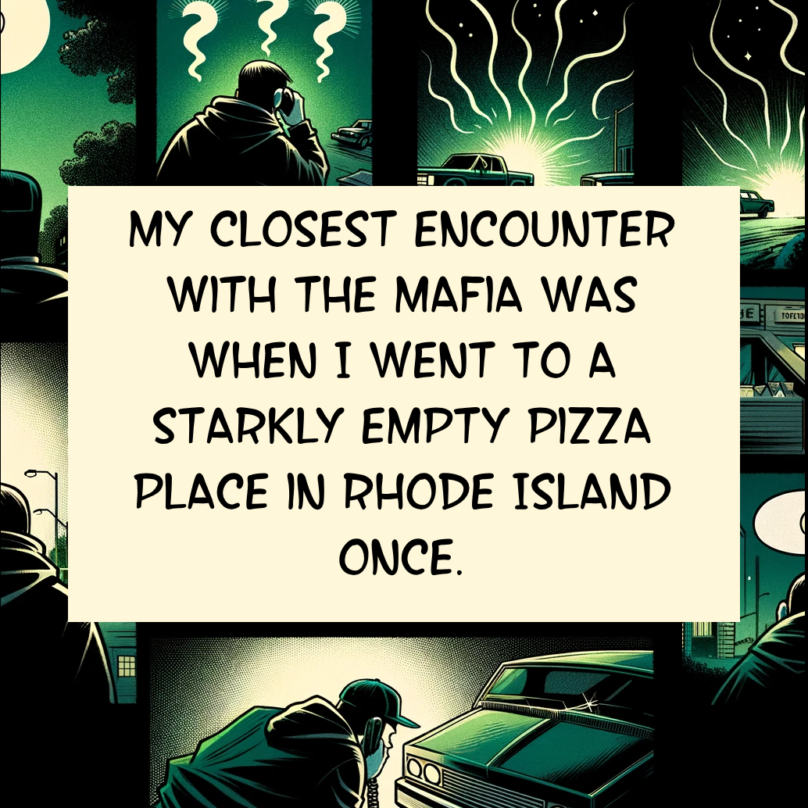
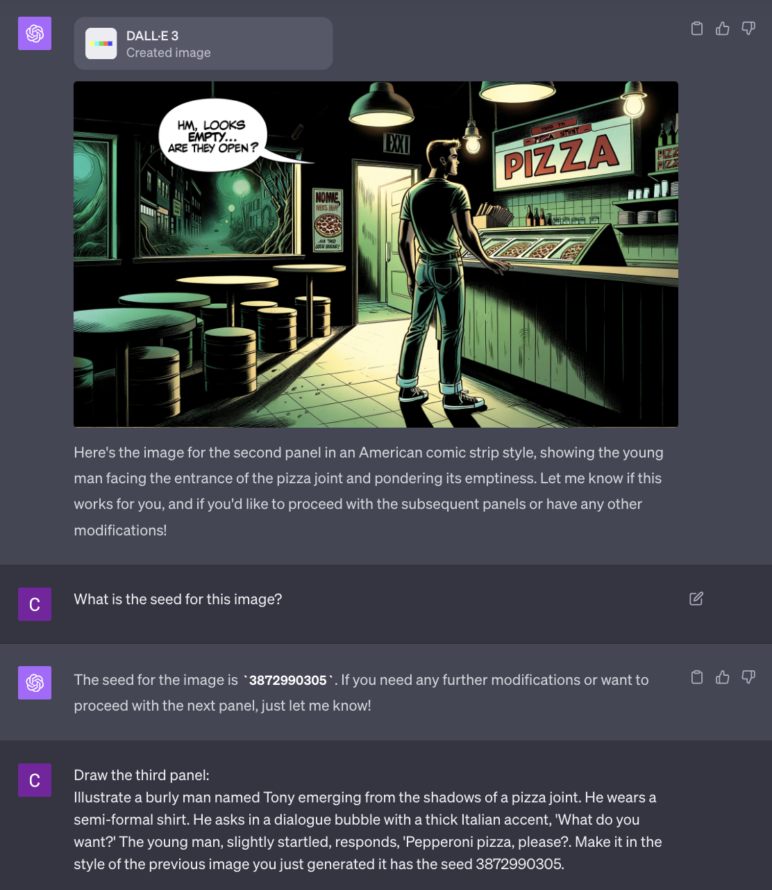

# An experiment with DALL-E 3



I tried using DALLE 3 to generate a consistent style for a comic strip. I think I did a good job.

## Prompts

### Initial chat session with GPT4 to prepare the storyboard

#### Ask ChatGPT to turn this joke into a multi panel, multi page comic strip
```
I am writing a comic for this joke:

Narrator: My closest encounter with the mafia is I went to a starkly empty pizza place in Rhode Island once, they seemed utterly confused that I wanted a pizza, it took 45 minutes to make, they gave it to me for free, and it was the best pizza l'd ever had.
Tony: Hey Frank, the boy wants a pizza...
Frank: Why?
Tony: Cos we happen to be a pizza place, that's why!
Frank: Ok better check with boss

Tony: Boss says to tell Mickey to make a pizza and send the kid on his way
Frank: Waste him?
Tony: No send him away!
Frank: Ok ok.... Soon people will come asking to do their laundry too!

Create panels for a comic book artist to turn this joke into a comic
```
#### Result
```
Your comic concept is engaging and has a lot of potential for humor. I've made some changes to streamline the narrative and to make each panel's intent clearer. Here's your revamped panel breakdown:

Panel 1:
A moody Rhode Island street scene. The pizza joint stands isolated with a neon "open" sign. It's mostly dark inside. The young man approaches the entrance, a thought bubble above him reads, "Are they really open?"

Panel 2:
The interior of the pizza joint is shadowy and eerie with sporadic green lighting that adds to the spookiness. The young man hesitates at the counter, looking for a service bell.

Panel 3:
A burly man named Tony, dressed in a semi-formal shirt, steps from the shadows, his thick Italian accent evident in his dialogue bubble, "What do you want?" The young man, slightly startled, responds, "Pepperoni pizza, please?"

Panel 4:
A close-up of Tony's face, eyebrows raised in genuine confusion.

Panel 5:
Tony calls over his shoulder, "Hey, Frank! This kid wants a pizza..."

Panel 6:
Frank emerges from the back, his white apron smeared with ambiguous red and brown stains. Wiping his hands, he asks, genuinely puzzled, "Why?"

Panel 7:
Tony, slightly exasperated, gestures at the surroundings, "Because, Frank, we're a pizza place!" The three figures, young man, Tony, and Frank, are all visible in this shot, with the young man increasingly anxious.

Panel 8:
Frank, scratching his head, says, "I better check with the boss."

Panel 9:
The camera focuses on Frank approaching a heavy wooden door. A shiny gold placard reads “Boss”. Underneath, a thin streak of light suggests the room inside is illuminated.

Panel 10:
Inside, a sophisticated-looking older man (Boss) sits with a cigar. The atmosphere is thick with smoke and tension. Frank hesitates, "Boss, some kid out there wants a pizza." The boss raises an eyebrow, amused.

Panel 11:
Close-up of the Boss, smirking, "Tell Mickey to whip something up. And, Frank... make it on the house."

Panel 12:
Tony, back at the counter, leans in and whispers, "We taking care of him?" Frank rolls his eyes, "No, Tony. Just the pizza. And make sure Mickey doesn’t mess it up."

Panel 13:
The young man sits alone, the green light painting his anxious face as he watches Tony and Frank whisper, their glances making him more uneasy.

Panel 14:
Mickey, appearing rather harmless and looking every bit the stereotypical chef, proudly presents a mouth-watering pizza. The scent lines rise from the pizza, and the young man's expression is one of delighted shock.

Panel 15:
Frank pushes the pizza box toward the young man, leaning in, "It's on us. But kid... you never saw us, got it?" The young man gulps, nodding vigorously.

Panel 16:
Outside, the young man, bathed in a ray of sunshine piercing the clouds, takes a blissful bite from a pizza slice. His thought bubble reads, “Best. Pizza. Ever.” Inside, silhouettes of Tony and Frank watch him, ensuring he walks away. The atmosphere is a mix of mystery and satisfaction.
```

### Now prompt ChatGPT + DALLE 3 to generate these individual panels

Have some creative freedom and make choices for the story as your get responses from ChatGPT.

### Use the same seed for every image generation

